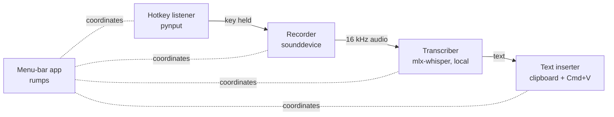

# RylanFlow

[](https://github.com/andersonrylan-gif/RylanFlow/actions/workflows/ci.yml)

**Hold a key, talk, release — your words appear wherever you're typing.**
On-device dictation for macOS, powered by Whisper running locally on Apple Silicon. No cloud, no subscription, works offline.

## How it works



Each stage is a small module behind an interface, so pieces can be swapped or reused (the v0.2 meeting recorder reuses the recorder and transcriber unchanged).

See [docs/architecture.md](docs/architecture.md) and the [decision records](docs/decisions/) for the design.

## Features
- Hold **Right Option**, talk, release: the transcript is pasted into the focused app and your clipboard is restored
- Runs Whisper on-device (mlx-whisper), so it is free, private and works offline
- Menu-bar icon shows idle 🎙, recording 🔴 and transcribing ⏳
- Menu: pick the model and hotkey, toggle sound cues and um/uh removal, **Copy last transcript**, **Open log**
- Settings in `~/.config/rylanflow/config.toml` (`hotkey`, `model`, `language`)

## Install

**Download the app (Apple Silicon Macs):**
1. Download `RylanFlow-0.1.1-macos-arm64.zip` from the [latest release](https://github.com/andersonrylan-gif/RylanFlow/releases/latest) and unzip it.
2. Drag **RylanFlow** into **Applications**.
3. The app isn't notarized, so the first time, right-click it, choose **Open**, then **Open** again.
4. Grant **Microphone**, **Accessibility** and **Input Monitoring** to RylanFlow in *System Settings → Privacy & Security*, then quit it from the 🎙 menu and open it again.
5. To start it at login: *System Settings → General → Login Items* and add RylanFlow.

Hold **Right Option**, talk, release.

## Run from source

Requires an Apple Silicon Mac and [uv](https://docs.astral.sh/uv/).

```bash
git clone https://github.com/andersonrylan-gif/RylanFlow.git
cd RylanFlow
uv sync
uv run rylanflow app
```

The first dictation downloads the Whisper model (about 150 MB for the fast model, about 1.6 GB for the accurate one). 

Other commands: `rylanflow record`, `rylanflow transcribe FILE.wav`, `rylanflow listen [--paste]`.

### macOS permissions
The app needs **Microphone**, **Accessibility** (to paste text) and **Input Monitoring** (for the global hotkey). macOS grants these to the app that launched it, so when you run from VS Code's terminal, add **Visual Studio Code** in *System Settings → Privacy & Security* (and Terminal, if you run it there), then restart that app.

## Development

```bash
uv run pytest        # tests
uv run ruff check .  # lint
```

## Roadmap
- **v0.1 — Dictation:** ✅ push-to-talk recording, local transcription, paste into any app, menu-bar app. packaged `.app` (v0.1.1)
- **v0.2 — Meetings:** capture mic + system audio, live chunked transcription, Markdown meeting notes

## License
[MIT](LICENSE)
