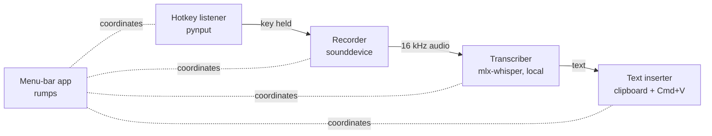

# RylanFlow

**Hold a key, talk, release — your words appear wherever you're typing.**
On-device dictation for macOS, powered by Whisper running locally on Apple Silicon. No cloud, no subscription, works offline.

> 🚧 Work in progress — building toward v0.1. See the [roadmap](#roadmap).

## How it works



Each stage is a small module behind an interface, so pieces can be swapped or reused (the v0.2 meeting recorder reuses the recorder and transcriber unchanged).

## Run it locally

Requires an Apple Silicon Mac and [uv](https://docs.astral.sh/uv/).

```bash
git clone https://github.com/andersonrylan-gif/RylanFlow.git
cd RylanFlow
uv sync
uv run rylanflow
```

### macOS permissions
The first run asks for **Microphone**, **Accessibility** (to paste text), and **Input Monitoring** (for the global hotkey). When running from VS Code's terminal, grant these to VS Code in *System Settings → Privacy & Security*.

## Development

```bash
uv run pytest        # tests
uv run ruff check .  # lint
```

## Roadmap
- **v0.1 — Dictation:** push-to-talk recording, local transcription, paste into any app, menu-bar app, packaged `.app` release
- **v0.2 — Meetings:** capture mic + system audio, live chunked transcription, Markdown meeting notes

## License
[MIT](LICENSE)
