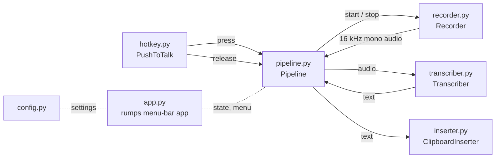

# Architecture

RylanFlow is a pipeline of small modules. Each one does one job behind a simple interface, so any of them can be tested with fakes or swapped later.

## Data flow
1. Holding the hotkey calls `Recorder.start()`, which streams microphone audio into a buffer.
2. Releasing it calls `Recorder.stop()`, which returns a numpy array.
3. Recordings under 0.3 s are treated as accidental taps and dropped.
4. The audio goes to `Transcriber.transcribe()` (local mlx-whisper by default), which returns text.
5. `ClipboardInserter.insert()` pastes the text into the focused app.

## Threading
- **Hotkey thread (pynput event tap):** only queues "press"/"release" and returns. It must never block: if it does, macOS stops delivering key events.
- **audio-control thread:** starts and stops the recorder, one event at a time.
- **mic-close threads:** `Recorder.stop()` returns the captured audio immediately and closes the PortAudio stream in the background, because stopping a stream can deadlock inside CoreAudio.
- **transcribe threads:** one per dictation, run one at a time.
- **Main thread:** a `rumps` timer reads `Pipeline.state` every 0.2 s to update the icon, and checks `Pipeline.restart_reason()`.

## Recovering from hangs
- If a mic stream is still closing after 3 s, or a transcription runs past `60 s + 3 × audio length`, the app logs a thread dump and relaunches itself (after any pending paste finishes).
- Recordings stop automatically after 10 minutes.
- `kill -USR1 <pid>` writes every thread's Python stack to the log.

## Extension points
- `Transcriber` is a protocol: a cloud engine can be added without touching the rest.
- The v0.2 meeting recorder reuses `Recorder` and `Transcriber` unchanged.

See also the decision records in [`decisions/`](decisions/).
