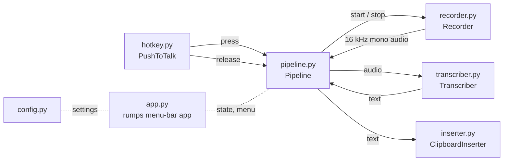

# Architecture

RylanFlow is a pipeline of small modules. Each one does one job behind a simple interface, so any of them can be tested with fakes or swapped later.

## Data flow
1. Holding the hotkey calls `Recorder.start()`, which streams microphone audio into a buffer.
2. Releasing it calls `Recorder.stop()`, which returns a numpy array.
3. Recordings under 0.3 s are treated as accidental taps and dropped.
4. The audio goes to `Transcriber.transcribe()` (local mlx-whisper by default), which returns text.
5. `ClipboardInserter.insert()` pastes the text into the focused app.

## Threading
- The `pynput` listener runs on its own thread and only sets state and starts or stops the recorder.
- Transcription runs on a worker thread, one at a time, so the hotkey stays responsive.
- Only the main thread touches the UI: a `rumps` timer reads the shared state every 0.2 s and updates the menu-bar icon.
- `Pipeline` always calls `on_done`, even on a tap or a failure, so the icon cannot stick on "working".

## Extension points
- `Transcriber` is a protocol: a cloud engine can be added without touching the rest.
- The v0.2 meeting recorder reuses `Recorder` and `Transcriber` unchanged.

See also the decision records in [`decisions/`](decisions/).
